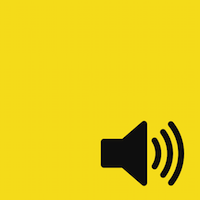

# WebAudio Hack Day
WebAudio Hack Day at DevFest.Asia 2015

 

## Projects

- [Korg NanoKontrol support for JSM Player](https://github.com/sonoport/jsmplayer) - [Chinmay](https://github.com/notthetup/)
- [LineOut.js](https://github.com/nbiton/LineOut) - [Tan Shiaw Uen](https://github.com/shiawuen) and [Naor Biton](https://github.com/nbiton)

## What?

WebAudio Hack Day is a day long event part of DevFest.Asia 2015. The idea is to hack on WebAudio and create hacks, libraries, demos, musical instruments, apps based on WebAudio and WebMIDI. 

The event is suited for advanced Web Audio hackers and Web Audio beginners. We will provide learning materials and help for people that are curious to learn more about the Web Audio API as well!

Inspired by [WebAudio Hack Day at JSConfEU](http://janmonschke.com/blog/2014/10/03/web-audio-hackday-2014.html)

## Details

**Time:** 11am-8pm

**Venue:** SkyScanner Office, 39 Robinson Road #08-01 Robinson Point Singapore 068911

**Tickets:** http://2015.devfest.asia/#Sat21

### Discussions

Join the chat for more discussions and links [https://gitter.im/devfestasia/discussions](https://gitter.im/devfestasia/discussions)

### Format
We'll have a couple of talks at the beginning from @padenot and @mmckegg to introduce WebAudio. Then we can form small groups (2-3 each) and work on any hack/project/app we are interested in. At the end of the day we can demo our hack/project/app to everyone. We'll all vote for the best hack/project/app and that group will get a prize. :)

### Schedule

11:00 : Registration

11:15 : Talk 1 (20-30mins)

11:45 : Talk 2 (20-30mins)

12:15 : Introductions + Ideas

13:00 : Lunch

19:00 : Demos

20:00 : Dinner

20:30 : Performance

### ToBring

1. Laptop
2. Power adapters for your Laptop
3. Headphones
4. MIDI Controllers (optional)
5. Any other hardware you want to try to connect to the browser (optional).

### Rules
To qualify for the prize:

- your hack/project/app should have either WebAudio/WebMIDI as a main component.
- most of the work on your hack/project/app should have been doing during the WebAudio Hack Day.

## Resources

### Specs
[WebAudio Spec](https://webaudio.github.io/web-audio-api/)

[WebMIDI Spec](http://webaudio.github.io/web-midi-api)

### Libraries, Links, etc
[WebAudio Awesome](https://github.com/notthetup/awesome-webaudio)

[WebAudio Weekly](http://blog.chrislowis.co.uk/waw.html)

### Demos, apps
[WebAudio Demos](https://webaudiodemos.appspot.com/)

[MOAR WebAudio Demos](https://webaudio.github.io/demo-list/)
 
## Code Of Conduct
[DevFest Code of Conduct](http://2015.devfest.asia/code-of-conduct.html)

## Thanks!
[DevFest.Asia](http://devfest.asia/)

[SkyScanner](http://www.skyscanner.com.sg/)

[Sonoport](http://sonoport.com/)

